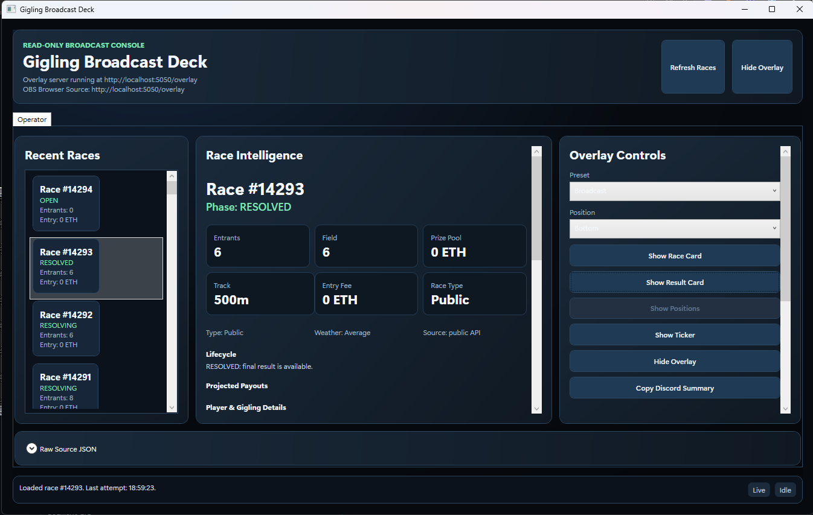
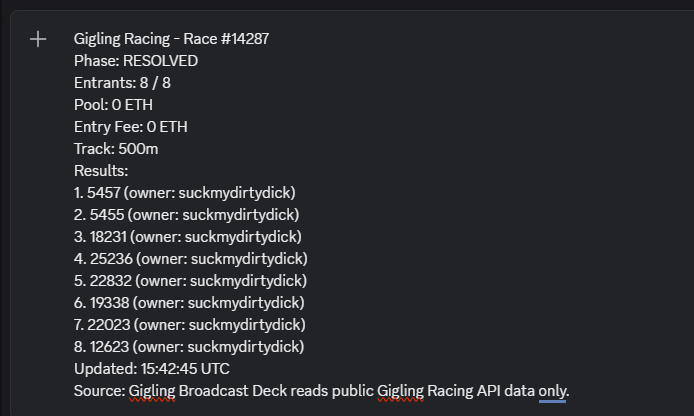
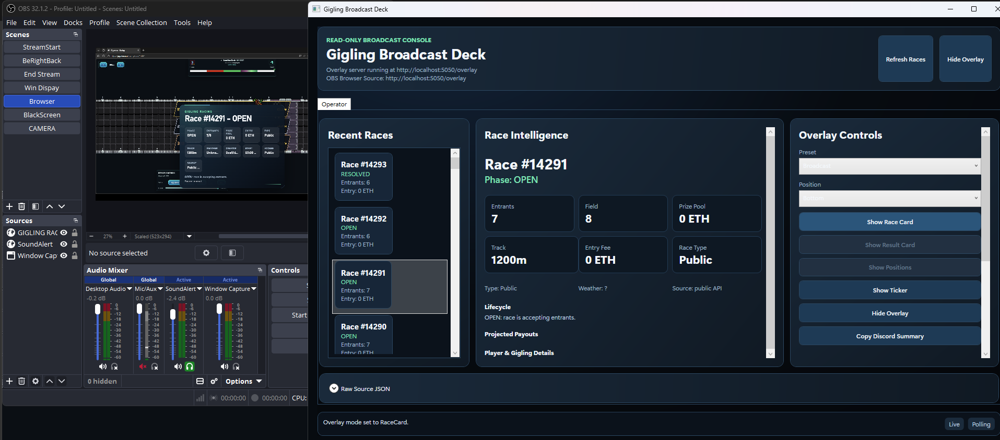
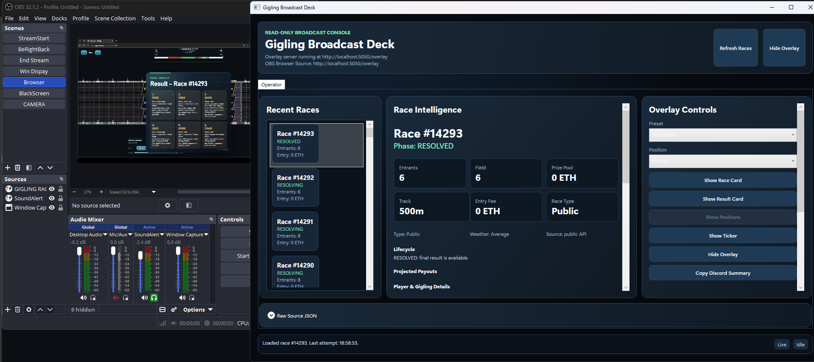

# Gigling Broadcast Deck

Gigling Broadcast Deck is a Windows desktop operator panel and OBS Browser Source overlay for Gigling Racing streams.

It turns public Gigling Racing race data into clear race cards, result cards, ticker copy, Discord summaries, and source-data transparency for creators.

## Problem

Gigling Racing data is useful on stream, but raw API responses are not easy to present live. Streamers need a small control surface that can select a race, explain what is happening, and send a readable overlay to OBS without handling wallets or gameplay actions.

## What It Does

- Fetches public Gigling Racing race data.
- Shows recent races and selected race details in a WPF operator panel.
- Preserves raw JSON so race data can be verified during a demo.
- Serves a local overlay at `http://localhost:5050/overlay`.
- Lets an operator show a race card, result card, ticker, or hidden overlay.
- Shows race card metadata such as phase, entrants, prize pool, entry fee, race type, track, weather/temperature, creator, start time, access, and source when available.
- Shows resolved result cards with owner names, wallet fallback, entry slot, juiced state, finish time, and public owner/Gigling profile details when available.
- Lets an operator pin and clear rundown/ticker lines.
- Copies a detailed Discord-friendly race summary, including result places and owner names/addresses when a resolved race exposes that data.

## MVP Features

- WPF desktop operator panel.
- Public REST polling with stale/error states.
- Public owner-profile enrichment with retry after transient lookup failures.
- ASP.NET Core Minimal API localhost server.
- Static HTML/CSS/JS OBS overlay.
- Overlay modes: `Hidden`, `RaceCard`, `ResultCard`, `Ticker`.
- Overlay presets: `Broadcast`, `Compact`, `DataDesk`.
- Overlay positions: lower-left, lower-right, top-left, top-right, bottom.
- Raw source JSON panel.
- Loading, empty, API-error, stale-data, fallback, and unavailable-endpoint states.
- Self-contained Windows publish script.

## Not Supported

This project is intentionally read-only.

- No wallet custody.
- No private key or seed phrase handling.
- No transaction signing.
- No race joining.
- No reward claiming.
- No item usage.
- No auto-play or gameplay automation.
- No authenticated gameplay POST endpoints.
- No OBS WebSocket control in the MVP.

## Architecture Overview

```text
Gigling Racing public API
  -> GigaverseRacingClient
  -> RaceMapper
  -> RacePollingService
  -> MainWindowViewModel
  -> OverlayStateService
  -> LocalOverlayServer
  -> /api/overlay-state
  -> overlay.js
  -> OBS Browser Source
```

Projects:

- `src/GiglingBroadcastDeck.Core`: domain models, API client, mapping, polling, overlay state, summary formatting.
- `src/GiglingBroadcastDeck.App`: WPF UI, dependency injection, local overlay server, preferences, static overlay assets.
- `tests/GiglingBroadcastDeck.Tests`: xUnit tests for mapping, polling, overlay state, summaries, and phase explanations.

More detail: [docs/ARCHITECTURE.md](docs/ARCHITECTURE.md).

## Technology Stack

- C# / .NET 10
- WPF
- ASP.NET Core Minimal API
- Static HTML/CSS/JS
- `HttpClient`
- `System.Text.Json`
- xUnit

## Build

```powershell
dotnet restore GiglingBroadcastDeck.slnx
dotnet build GiglingBroadcastDeck.slnx --configuration Release
```

## Run

```powershell
dotnet run --project .\src\GiglingBroadcastDeck.App\GiglingBroadcastDeck.App.csproj
```

Default local URLs:

- Overlay: `http://localhost:5050/overlay`
- Health: `http://localhost:5050/api/health`
- Overlay state: `http://localhost:5050/api/overlay-state`

## Test

```powershell
dotnet test tests\GiglingBroadcastDeck.Tests\GiglingBroadcastDeck.Tests.csproj --configuration Release
```

## Publish Demo Build

```powershell
.\scripts\publish-win-x64.ps1 -Configuration Release
```

The publish folder is:

```text
src\GiglingBroadcastDeck.App\bin\Release\net10.0-windows\win-x64\publish
```

## OBS Browser Source Setup

1. Start Gigling Broadcast Deck.
2. Confirm the app header says the overlay server is running.
3. Open OBS Studio.
4. Add Source -> Browser.
5. URL: `http://localhost:5050/overlay` or the port shown in the app.
6. Width: `1920`.
7. Height: `1080`.
8. Enable transparent background if needed.
9. Use `Show Race Card`, `Show Result Card`, `Show Ticker`, and `Hide Overlay` in the app.

## Gigaverse Endpoints Used

All calls are public read-only `GET` requests under `Gigaverse:BaseUrl`, defaulting to `https://gigaverse.io/api/racing/`.

- `GET races?limit={RaceLimit}`
- `GET race/{raceId}`
- `GET race-state?raceId={raceId}`
- `GET /api/frontend/noob-summary?wallet={ownerAddress}`

Details: [docs/API_NOTES.md](docs/API_NOTES.md).

## Configuration

Runtime settings live in `src/GiglingBroadcastDeck.App/appsettings.json`.

Important defaults:

- `Overlay:Port`: `5050`
- `Polling:RecentRacesSeconds`: `15`
- `Polling:SelectedRaceSeconds`: `5`
- `Polling:StaleAfterSeconds`: `45`
- `Realtime:Enabled`: `false`

Operator preferences are stored in the current user's local app data folder and contain only overlay preset, overlay position, and rundown items.

## Known Limitations

- The app depends on public Gigling Racing API availability.
- If there are no current races, the race list can be empty.
- API response shapes may change; the app uses tolerant mapping and stale-data handling.
- Realtime is disabled for the MVP.
- `Show Positions` is temporarily disabled while live-position rendering is refined.
- There is no built-in mock data mode yet.
- The publish output is a self-contained folder, not a signed installer.

## Hackathon Submission Notes

- Suggested category fit: player/creator tools, analytics, broadcast utility, developer-facing transparency.
- Primary demo path: select a race, show raw source data, send race card/ticker/result card to OBS, copy a Discord summary with final places and owners for resolved races when available.
- Safety statement: the app is read-only and non-custodial; it never signs transactions or automates gameplay.

## Demo Assets

Demo videos:

- [Real-world usage video](demo/RealWorldUsage.mp4)

Screenshots:

| Operator App | Race Summary |
| --- | --- |
|  |  |

| Race Card Overlay | Race Results Overlay |
| --- | --- |
|  |  |

## Documentation

- [Architecture](docs/ARCHITECTURE.md)
- [Testing and Demo](docs/TESTING_AND_DEMO.md)
- [API Notes](docs/API_NOTES.md)
- [Hackathon Submission](docs/HACKATHON_SUBMISSION.md)

## License

MIT. See [LICENSE.md](LICENSE.md).
